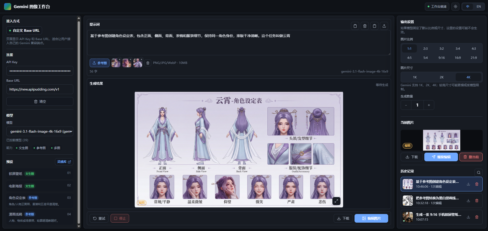
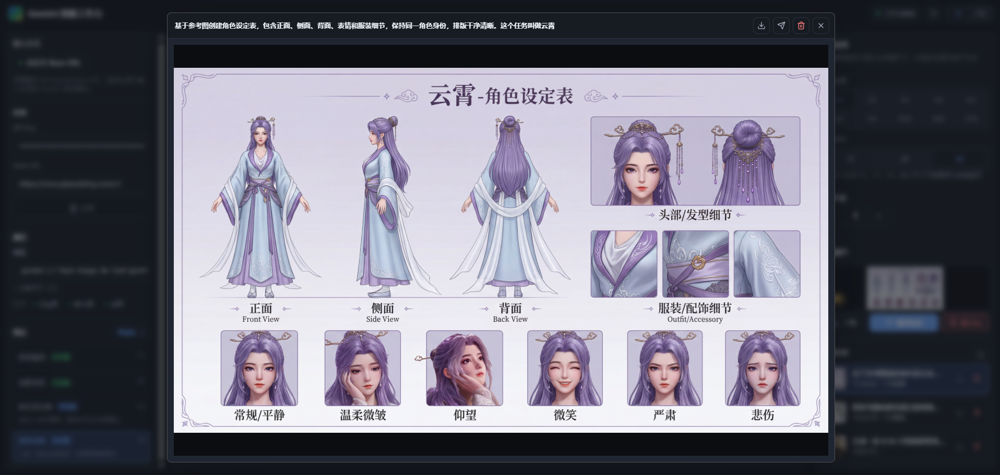
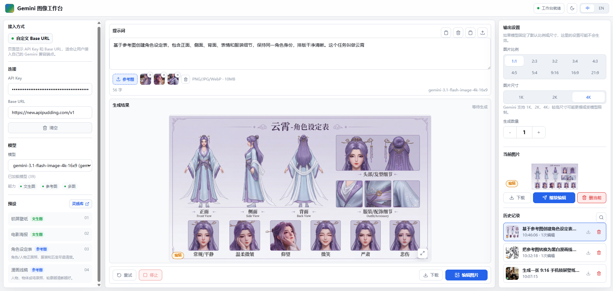
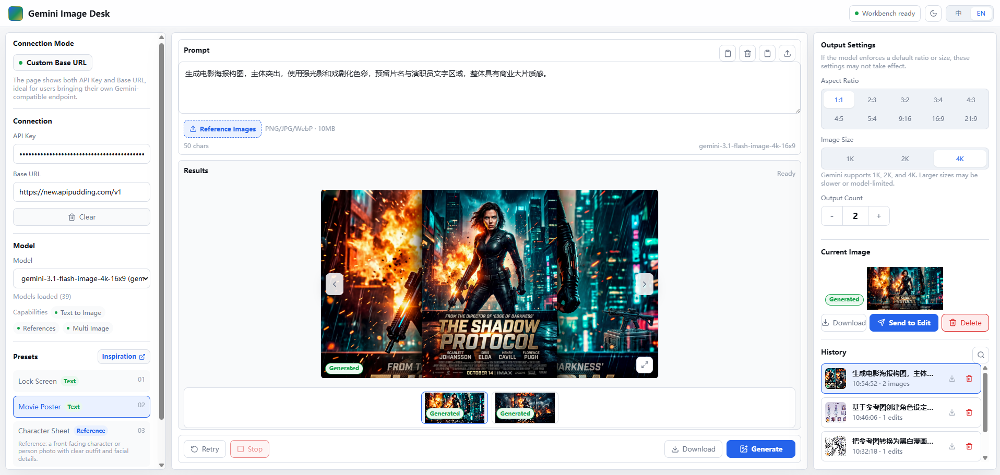

<div align="center">
  <h1>Gemini Image Desk</h1>
  <p>面向 Gemini 图像模型的本地 / 自托管图像生成工作台。</p>
  <p>
    
    
    
    
    
    
  </p>
  <p>
    <a href="#界面预览">界面预览</a> ·
    <a href="#模型支持">模型支持</a> ·
    <a href="#功能特性">功能特性</a> ·
    <a href="#快速开始">快速开始</a> ·
    <a href="#docker-部署">Docker 部署</a> ·
    <a href="#项目文档">项目文档</a>
  </p>
</div>

## 项目简介

Gemini Image Desk 是一个专注于 Gemini 图像生成与编辑的第一屏工作台，不是通用聊天应用。它保留高效、少废话的工作流：打开即用，围绕 prompt、参考图、生成、编辑、历史和下载完成核心闭环。

项目默认中文界面，同时内置英文文案；API 请求通过 `lib/providers/` 下的 provider adapter 统一封装，避免 UI 组件直接耦合 Gemini 请求细节。

## 界面预览

<table>
  <tr>
    <td width="50%" align="center">
      
      <br>
      <sub>暗黑模式三栏工作台</sub>
    </td>
       <td width="50%" align="center">
      
      <br>
      <sub>放大查看生成图</sub>
    </td>
  </tr>
  <tr>
    <td width="50%" align="center">
      
      <br>
      <sub>亮色模式工作台</sub>
    </td>
    <td width="50%" align="center">
      
      <br>
      <sub>英文界面与多图结果</sub>
    </td>
  </tr>
</table>


## 模型支持

Gemini Image Desk 会在填写 API Key 后通过 `/api/models` 动态加载可用模型；下面只是 README 的模型速查块，方便确认 Nano Banana 系列的名称和实际 model id。模型可用性会随 Gemini API 更新，请以你的账号返回结果和官方文档为准。

<div align="center">
  <table>
    <tr>
      <td width="33%" align="left">
        <strong><a href="https://ai.google.dev/gemini-api/docs/models/gemini-3.1-flash-image-preview">Nano Banana 2</a></strong><br>
        <sub>高效率图像生成、参考图编辑、高频 prompt 迭代。</sub><br><br>
        <code>gemini-3.1-flash-image-preview</code>
      </td>
      <td width="33%" align="left">
        <strong><a href="https://ai.google.dev/gemini-api/docs/models/gemini-3-pro-image-preview">Nano Banana Pro</a></strong><br>
        <sub>适合专业成片、复杂构图、4K、文本渲染和真实世界 grounding。</sub><br><br>
        <code>gemini-3-pro-image-preview</code>
      </td>
      <td width="33%" align="left">
        <strong><a href="https://ai.google.dev/gemini-api/docs/image-generation">Nano Banana</a></strong><br>
        <sub>Gemini 2.5 Flash Image，适合快速创意工作流和兼容旧项目。</sub><br><br>
        <code>gemini-2.5-flash-image</code><br>
        <code>gemini-2.5-flash-image-preview</code>
      </td>
    </tr>
  </table>
</div>

## 功能特性

- 三栏工具布局：左侧配置，中间创作，右侧参数与历史。
- 支持文本生成图像、参考图上传、继续编辑、结果预览、下载与历史记录。
- 填写 API Key 后动态加载账号可用模型，README 提供 Nano Banana 系列 model id 速查。
- 默认暗黑模式，提供亮色 / 暗黑手动切换。
- 支持 `zh-CN` 与 `en-US`，UI 文案通过 i18n 字典读取。
- API Key 默认只保存在浏览器本地，支持一键清除。
- 服务端 API 代理：`/api/generate` 与 `/api/models`。
- 网络错误、模型错误、鉴权错误统一转换为用户可读错误。
- 图片历史第一版使用浏览器本地存储与 IndexedDB。
- 已准备 Next.js standalone 与 Docker Compose 部署方式。

## 快速开始

环境要求：

- Node.js 20+
- npm 10+

安装依赖并启动开发服务：

```bash
npm install
npm run dev
```

打开：

```text
http://localhost:3000
```

## 环境变量

复制 `.env.example` 为 `.env.local`，再按需要调整：

```bash
cp .env.example .env.local
```

Windows PowerShell：

```powershell
Copy-Item .env.example .env.local
```

常用配置：

| 变量 | 说明 | 默认值 |
| --- | --- | --- |
| `PORT` | 本地服务端口 | `3000` |
| `GEMINI_BASE_URL` | Gemini API Base URL | `https://generativelanguage.googleapis.com` |
| `GEMINI_DEFAULT_MODEL` | 默认图像模型 | `gemini-2.5-flash-image` |
| `PUBLIC_BASE_URL_CONFIG` | 是否允许用户在 UI 中填写 Base URL | `false` |

不要提交真实 API Key。用户输入的 Key 默认只保存在浏览器本地，不会写入仓库。

## Docker 部署

已发布 Docker Hub 镜像：

```text
https://hub.docker.com/repository/docker/tannic666/gemini-image-desk
```

直接运行镜像：

```bash
docker pull tannic666/gemini-image-desk:latest
docker run --rm -p 3000:3000 \
  -e GEMINI_BASE_URL=https://generativelanguage.googleapis.com \
  -e GEMINI_DEFAULT_MODEL=gemini-2.5-flash-image \
  -e PUBLIC_BASE_URL_CONFIG=false \
  tannic666/gemini-image-desk:latest
```

也可以从当前仓库本地构建并启动：

```bash
docker compose up --build
```

默认访问：

```text
http://localhost:3000
```

不要把真实 API Key 写进镜像或 compose 配置。当前版本由用户在浏览器里填写 API Key，并默认只保存在浏览器本地。

## 可用脚本

| 命令 | 用途 |
| --- | --- |
| `npm run dev` | 启动 Next.js 开发服务 |
| `npm run build` | 构建生产版本 |
| `npm run start` | 启动生产服务 |
| `npm run typecheck` | 执行 TypeScript 类型检查 |

## 目录结构

```text
app/                 Next.js App Router 页面与 API routes
components/          工作台 UI 组件
lib/i18n/            中英文文案字典
lib/providers/       Gemini provider adapter 与错误转换
types/               共享 TypeScript 类型
docs/                产品、设计、架构、部署与 API 文档
prototype/           早期本地 HTML 原型
```

## 项目文档

- [产品规格](docs/PRODUCT_SPEC.md)
- [设计规则](docs/DESIGN_RULES.md)
- [技术架构](docs/ARCHITECTURE.md)
- [API 规则](docs/API_RULES.md)
- [i18n 规则](docs/I18N.md)
- [部署方案](docs/DEPLOYMENT.md)
- [Git 规则](docs/GIT_RULES.md)
- [协作规则](AGENTS.md)
- [任务清单](TASKS.md)
- [本地设计原型](prototype/README.md)

## 安全说明

- 不提交真实 API Key、截图中的 Key 或示例 Key。
- 不在 console、server log 或错误信息中输出完整 API Key。
- 本地保存 API Key 时，UI 必须提供一键清除。
- 如果未来支持服务端代理 Key，需要明确区分用户输入 Key 与服务器环境变量 Key。

## License

暂未声明。
